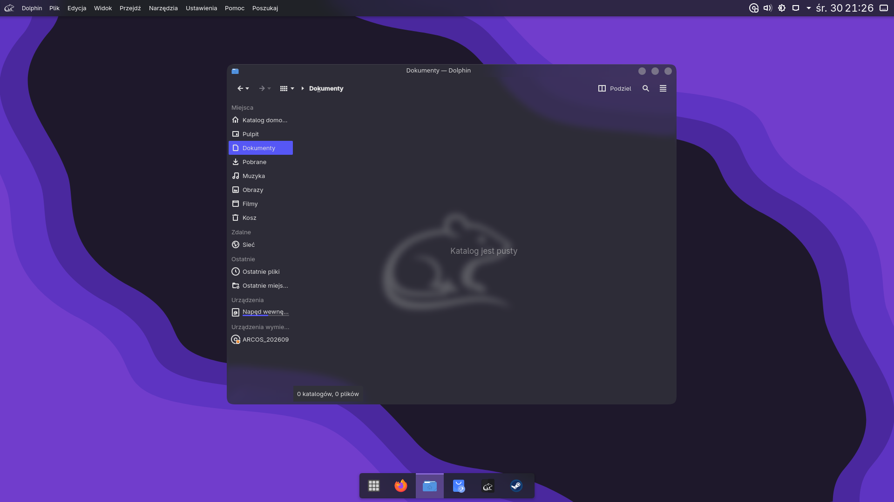
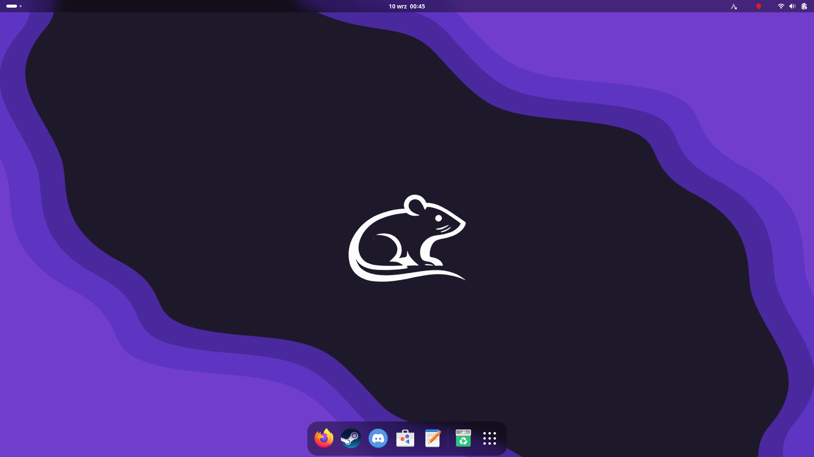
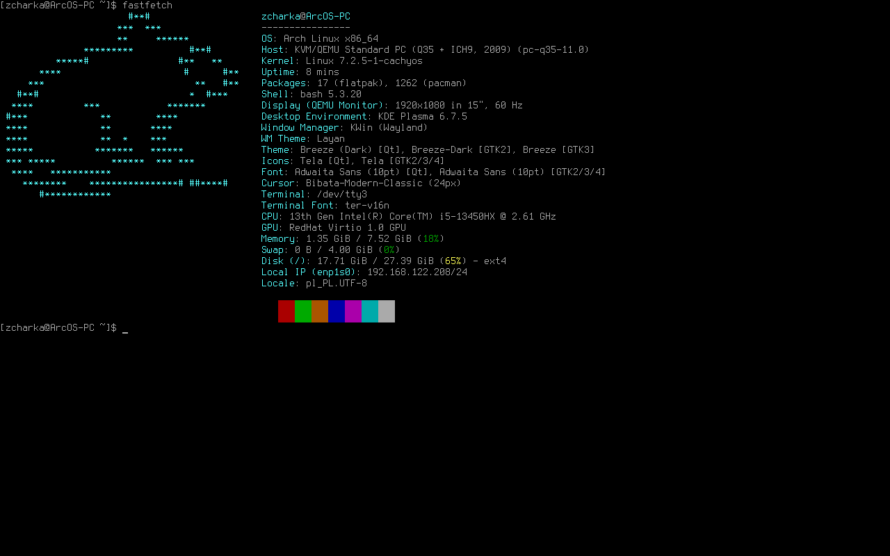

# ArcOS

  <a href="https://github.com/zcharka/ArcOS/blob/main/documentation.docx">Dokumentacja</a>
  &nbsp;&nbsp;&nbsp;•&nbsp;&nbsp;&nbsp;
  <a href="https://zcharka.github.io/ArcOS/">Strona ArcOS</a>
  &nbsp;&nbsp;&nbsp;•&nbsp;&nbsp;&nbsp;
  <a href="https://zcharka.github.io/ArcOS/download.html">Pobierz ISO</a>
  &nbsp;&nbsp;&nbsp;•&nbsp;&nbsp;&nbsp;
  <a href="https://zcharka.github.io/ArcOS/download.html">Minimalne wymagania</a>

ArcOS jest forkiem dystrybucji Arch Linux. Działa na jądrze cachyos i ma wbudowanego syeama, gamemode i gamescope, przez co jest gotowa do gier. Posiada własne aplikacja napisane specjalnie z myślą o niej:

- [Arc Center](https://github.com/zcharka/Arc-Center)
- [Arc Store](https://github.com/zcharka/arc-store)
- [Arc Hello](https://github.com/zcharka/arc-hello)
- [Arc Desktop Presets](https://github.com/zcharka/arc-desktop-presets)
- [ArcOS Updater](https://github.com/zcharka/arcos-updater)
- [ArcOS Installer](https://github.com/zcharka/ArcOS-Installer)

Dystrybucja posiada własne wyglądy takie jak:

<table>
  <tr>
    <td align="left">
      
       
      <b>KDE Plasma</b>
    </td>
    <td align="right">
      
       
      <b>GNOME</b>
    </td>
  </tr>

  <tr>
    <td align="left">
      
       
      <b>Cinnamon</b>
    </td>
    <td align="right">
      
       
      <b>Brak środowiska graficznego</b>
    </td>
  </tr>
</table>

## UWAGA!
Nie wybieraj innych środowisk graficznych niż Plasma na tą chwilę. Te opcje nie działają (kernel panic, brak GRUBa i tak dalej). Dalej pracuje nad nimi
